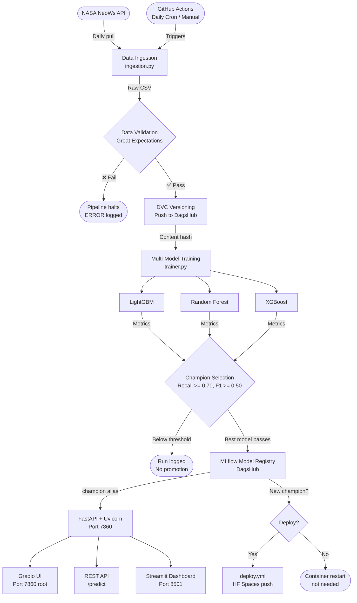

# ☄️ NEO-Sentinel: Autonomous Asteroid Hazard Classification System

> **Production-grade MLOps pipeline for real-time asteroid threat classification using NASA open data.**

[](https://python.org)
[](https://fastapi.tiangolo.com)
[](https://xgboost.readthedocs.io)
[](https://dagshub.com/Govinthan-KS/Asteroid-Hazard-Classifier)
[](https://huggingface.co)
[](https://github.com/Govinthan-KS/Asteroid-Hazard-Classifier/actions)

---

## What This System Does

NEO-Sentinel ingests Near-Earth Object (NEO) telemetry from NASA's NeoWs API on a daily schedule, validates the incoming data, trains a multi-model ensemble, promotes the best-performing model to a live production alias, and serves predictions via a REST API and interactive UI — all inside a single Docker container on HuggingFace Spaces with zero manual intervention.

**The ML design constraint:** Recall is the primary optimization objective. A missed hazardous asteroid is catastrophically worse than a false alarm. The system only promotes a model to production when all three thresholds are simultaneously satisfied:

| Metric | Current Threshold | Production Target | Rationale |
|--------|------------------|------------------|--------|
| **Recall** | ≥ 0.70 | ≥ 0.90 | Must not miss hazardous objects |
| **F1 Score** | ≥ 0.50 | ≥ 0.85 | Balances precision with high recall |
| **ROC-AUC** | ≥ 0.80 | ≥ 0.92 | Full discriminability across all thresholds |

> **Note:** Thresholds are temporarily relaxed for sparse 30-day rolling datasets (≤ 300 hazardous samples). Production targets above are restored when data volume scales. See `configs/training/training.yaml`.

---

## System Architecture



---

## Pipeline Flow

```
[1] DATA INGESTION     NASA NeoWs API → GitHub Actions → Raw CSV (30-day rolling window)
        ↓
[2] DATA VALIDATION    Great Expectations → Schema + physical range checks → hard gate
        ↓
[3] DATA VERSIONING    DVC add + push → DagsHub remote (content-hashed, reproducible)
        ↓
[4] MODEL TRAINING     LightGBM + Random Forest + XGBoost → MLflow on DagsHub
        ↓
[5] CHAMPION SELECTION Recall >= 0.70, F1 >= 0.50, ROC-AUC >= 0.80 -> @champion alias
        ↓
[6] SERVING            FastAPI + Gradio → This HuggingFace Space
        ↓
[7] OBSERVABILITY      Loguru structured logs + Streamlit Admin Dashboard (port 8501)
        ↓
[8] CI/CD              GitHub Actions → daily cron retrain + conditional redeploy
```

---

## Technical Stack

| Layer | Technology | Role |
|-------|-----------|------|
| **ML Models** | XGBoost, LightGBM, Random Forest | Multi-model benchmarking — best wins |
| **Preprocessing** | Scikit-Learn | `ColumnTransformer` + Hybrid SMOTE oversampling |
| **Experiment Tracking** | MLflow on DagsHub | Hyperparameters, metrics, artifacts, model registry |
| **Data Versioning** | DVC → DagsHub | Content-hashed, fully reproducible dataset lineage |
| **Data Validation** | Great Expectations | Physical + structural constraints, hard pipeline gate |
| **REST API** | FastAPI + Uvicorn | `POST /predict` with Pydantic telemetry validation |
| **Prediction UI** | Gradio | Interactive asteroid hazard query interface |
| **Admin Dashboard** | Streamlit | Champion metrics, live log viewer |
| **Config Management** | Hydra | Zero hardcoding — all values in `configs/*.yaml` |
| **Observability** | Loguru | Structured logs at every pipeline stage |
| **CI/CD** | GitHub Actions | Daily scheduled retrain + conditional redeploy |
| **Container** | Docker (python:3.12-slim) | Single image, HuggingFace Spaces |

---

## API Reference

| Endpoint | Method | Description |
|----------|--------|-------------|
| `/predict` | `POST` | Submit asteroid telemetry, receive hazard prediction |
| `/` | `GET` | Gradio interactive prediction interface (root, port 7860) |
| `/health` | `GET` | Liveness check — returns `{"status": "ok"}` |
| `/docs` | `GET` | FastAPI auto-generated Swagger UI |
| `/redoc` | `GET` | FastAPI ReDoc documentation |

### Prediction Request

```bash
curl -X POST https://<your-space>.hf.space/predict \
  -H "Content-Type: application/json" \
  -d '{
    "absolute_magnitude_h": 18.1,
    "estimated_diameter_min_km": 0.4,
    "estimated_diameter_max_km": 0.9,
    "relative_velocity_kmph": 62000.0,
    "miss_distance_km": 1800000.0,
    "orbiting_body": "Earth"
  }'
```

**Response:**
```json
{
  "is_potentially_hazardous": true,
  "confidence": 0.94,
  "model_alias": "@champion"
}
```

### Input Validation Constraints

All inputs are validated by Pydantic before reaching the model. Out-of-range values return `422 Unprocessable Entity`:

| Feature | Valid Range | Unit |
|---------|------------|------|
| `absolute_magnitude_h` | 10 – 35 | H magnitude |
| `estimated_diameter_min_km` | 0.0001 – 100 | km |
| `estimated_diameter_max_km` | 0.0001 – 100 | km |
| `relative_velocity_kmph` | 0 – 300,000 | km/h |
| `miss_distance_km` | 0 – 100,000,000 | km |
| `orbiting_body` | `"Earth"` only | — |

---

## Model Lineage

The serving layer **dynamically loads the `@champion` model alias** from the MLflow Model Registry at every container cold start. No model artifact is baked into the image.

```
DagsHub MLflow Registry
└── asteroid-hazard-classifier
    ├── v1  →  Archived
    ├── v2  →  Archived
    └── v3  →  @champion  ← loaded at runtime via mlflow.pyfunc.load_model()
```

**A newly promoted champion model becomes live on the next container restart — no redeployment or image rebuild required.**

- Registry URI: `models:/asteroid-hazard-classifier@champion`
- Experiment dashboard: [DagsHub MLflow](https://dagshub.com/Govinthan-KS/Asteroid-Hazard-Classifier.mlflow)

Champion selection uses a strict 3-stage process on each training run:
1. **Threshold gate** — all three metrics (recall, F1, ROC-AUC) must clear minimums
2. **Precision guardrail** — eliminates pure "predict-always-hazardous" dummy models
3. **Recall-primary sort** — highest recall wins; F1 is the tie-breaker; newer data wins exact ties

---

## CI/CD Pipeline

Two GitHub Actions workflows run automatically:

### `retrain.yml` — NEO-Sentinel Scheduled Retraining Pipeline
- **Triggers:** Daily at 13:00 IST (07:30 UTC) + manual `workflow_dispatch`
- **Steps:** Ingest → Validate → DVC Version → Train → Detect champion change → Conditional redeploy
- **Manual trigger:** GitHub → Actions → *NEO-Sentinel Scheduled Retraining Pipeline* → **Run workflow**

### `deploy.yml` — Deploy to HuggingFace Spaces
- **Triggers:** Push to `main` (code changes) + called by `retrain.yml` when a new champion is promoted
- **Action:** Force-pushes `HEAD:main` to the HuggingFace Spaces git remote

**Secrets required in GitHub Repository Secrets:**

| Secret | Purpose |
|--------|---------|
| `NASA_API_KEY` | NASA NeoWs API access |
| `DAGSHUB_TOKEN` | DagsHub + MLflow authentication |
| `MLFLOW_TRACKING_URI` | DagsHub MLflow server URL |
| `HUGGINGFACE_TOKEN` | HuggingFace Spaces push access |

**Variables required in GitHub Actions Variables:**

| Variable | Value |
|----------|-------|
| `DAGSHUB_REPO_OWNER` | DagsHub username |
| `DAGSHUB_REPO_NAME` | DagsHub repository name |
| `HF_SPACE_ID` | `owner/space-name` format |

---

## Runtime Configuration

All secrets are injected via **HuggingFace Spaces → Settings → Repository Secrets**. No credentials are baked into the image. The container validates all five required variables at startup and exits with a descriptive error if any are missing.

| Variable | Purpose |
|----------|---------| 
| `NASA_API_KEY` | NASA NeoWs API access |
| `DAGSHUB_TOKEN` | DagsHub authentication for MLflow Registry |
| `MLFLOW_TRACKING_URI` | DagsHub MLflow server URL |
| `DAGSHUB_REPO_OWNER` | DagsHub repository owner |
| `DAGSHUB_REPO_NAME` | DagsHub repository name |

---

## Repository Structure

```
asteroid-hazard-classifier/
├── .github/workflows/
│   ├── retrain.yml              # Scheduled + manual retraining pipeline
│   └── deploy.yml               # Deploy to HuggingFace Spaces
├── configs/                     # Hydra YAML — zero hardcoding in source
│   ├── config.yaml              # Root config, pulls in sub-configs
│   ├── data/ingestion.yaml      # NASA API key, date window, output paths
│   ├── training/training.yaml   # Promotion thresholds (recall, f1, roc_auc)
│   ├── api/default.yaml         # Host, port, model registry URI
│   └── models/                  # Per-model hyperparameter configs
│       ├── lightgbm.yaml
│       ├── random_forest.yaml
│       └── xgboost.yaml
├── src/asteroid_classifier/
│   ├── core/                    # Infrastructure layer
│   │   ├── config.py            # Hydra config loader
│   │   ├── logging.py           # Loguru setup — configured once, imported everywhere
│   │   └── exceptions.py        # Custom exception hierarchy (AsteroidPipelineError)
│   ├── data/                    # Data layer
│   │   ├── ingestion.py         # NASA NeoWs API client
│   │   ├── validation.py        # Great Expectations validation suite
│   │   ├── preprocessing.py     # ColumnTransformer + SMOTE pipeline
│   │   └── versioning.py        # DVC add + push (non-blocking)
│   ├── models/                  # Model layer
│   │   ├── trainer.py           # Multi-model benchmarking loop + champion selection
│   │   ├── registry.py          # MLflow Model Registry operations
│   │   └── predictor.py         # @champion model loader for serving
│   ├── api/                     # Presentation layer — FastAPI
│   │   ├── main.py              # Lifespan management, app factory
│   │   ├── routes.py            # /predict, /health endpoints
│   │   └── schemas.py           # Pydantic request/response models
│   └── ui/                      # Presentation layer — Gradio + Streamlit
│       ├── gradio_app.py        # Classification portal
│       └── dashboard.py         # Admin observability dashboard
├── docker/
│   ├── Dockerfile               # python:3.12-slim production image
│   └── entrypoint.sh            # Env validation + Streamlit + Uvicorn bootstrap
├── tests/
│   ├── unit/                    # Per-module unit tests
│   └── conftest.py              # Shared pytest fixtures
├── data/                        # DVC-tracked — gitignored
├── pyproject.toml               # Poetry dependency manifest
├── .env.example                 # Credential template — never commit .env
└── phase_tracking.md            # Phase delivery log
```

---

## Local Development

Run the full serving stack locally:

**1. Clone and install:**

```bash
git clone https://github.com/Govinthan-KS/Asteroid-Hazard-Classifier.git
cd Asteroid-Hazard-Classifier
poetry install
```

**2. Create `.env`** (gitignored — never commit):

```env
NASA_API_KEY=your_nasa_api_key
DAGSHUB_TOKEN=your_dagshub_token
MLFLOW_TRACKING_URI=https://dagshub.com/your_owner/your_repo.mlflow
DAGSHUB_REPO_OWNER=your_dagshub_owner
DAGSHUB_REPO_NAME=your_dagshub_repo_name
```

**3. Run the pipeline locally:**

```bash
# Ingest latest data
poetry run python -m asteroid_classifier.data.ingestion

# Validate
poetry run python -m asteroid_classifier.data.validation

# Train and promote
poetry run python -m asteroid_classifier.models.trainer

# Serve
PYTHONPATH=src poetry run uvicorn asteroid_classifier.api.main:app --host 0.0.0.0 --port 7860
```

**4. Or run via Docker:**

```bash
docker build -f docker/Dockerfile -t neo-sentinel:local .
docker run --rm --env-file .env -p 7860:7860 -p 8501:8501 neo-sentinel:local
```

| Service | URL |
|---------|-----|
| Prediction API | `http://localhost:7860/health` |
| Swagger UI | `http://localhost:7860/docs` |
| Gradio UI | `http://localhost:7860` |
| Admin Dashboard | `http://localhost:8501` |

---

*Built with 🔭 NASA open data · MLflow on DagsHub · FastAPI · Gradio · XGBoost · DVC · GitHub Actions*
